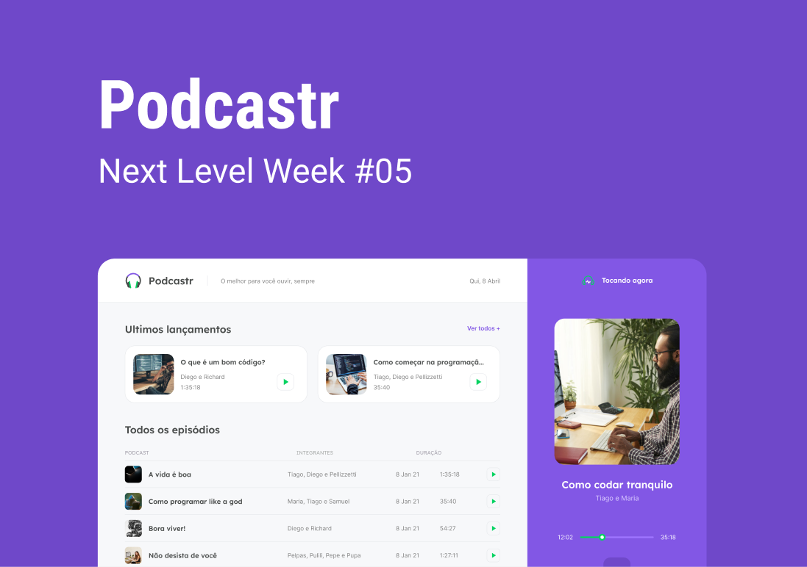
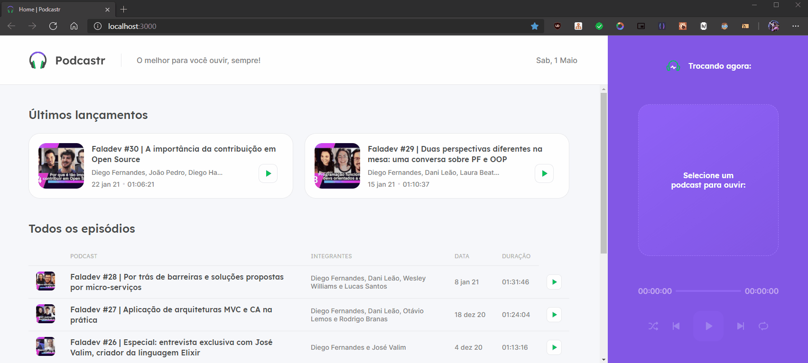

<h1 align=center>
  
    <h1 align=center> Podcastr </h1> 
  </img>
</h1>

<p align=center>
  
</p>


  <h1 align="center">  
    <a href="https://www.typescriptlang.org/" target="_blank"  rel="noopener noreferrer" >
      
    </a>
    <a href="https://pt-br.reactjs.org/docs/getting-started.html" target="_blank"  rel="noopener noreferrer">
      
    </a>
    <a href="https://code.visualstudio.com/" target="_blank"  rel="noopener noreferrer">
      
    </a>
    <a href="https://sass-lang.com/" target="_blank"  rel="noopener noreferrer">
      
    </a>
    <a href="https://nextjs.org/" target="_blank"  rel="noopener noreferrer">
      
    </a>
   </h1>

<h6 align=center>
  <a href="#notes-about">About</a>&nbsp;&nbsp;&nbsp;|&nbsp;&nbsp;&nbsp;
  <a href="#microphone-technologies">Technologies</a>&nbsp;&nbsp;&nbsp;|&nbsp;&nbsp;&nbsp;
  <a href="#musical_keyboard-getting-started">Getting Started</a>&nbsp;&nbsp;&nbsp;|&nbsp;&nbsp;&nbsp;
  <a href="#musical_note-upgrades">Upgrades</a>
</h6>

# :notes: About


The **Podcaster** is the Best place to listen your favorites podcasts :D

Application made based to NLW#5 intensival online event provides by  [Rocketseat](https://rocketseat.com.br/) 🚀

<p>
 &nbsp;&nbsp;&nbsp;
  <a href="https://www.figma.com/file/UwFEntsHpHYJlHNQAQr4gA/Podcastr?node-id=160%3A2761">Project Wireframe</a>
</p>




# :microphone: Technologies

#### 📃 Dependencies: -> <i><kbd> [package.json](./package.json) </kbd></i>

- [x] <b>[Next JS](https://nextjs.org/):</b> <i>To best way for create SSG or SSR pages</i>
- [x] <b>[Typescript](https://www.typescriptlang.org/):</b> <i>is written in TypeScript</i>
- [x] <b>[Axios](https://github.com/axios/axios):</b> <i>Best lib to work with Promise based HTTP client </i>
- [x] <b>[Date-fns](https://date-fns.org/):</b> <i>Best lib utility to use Date</i>
- [x] <b>[RC-Slider](https://www.npmjs.com/package/rc-slider):</b> <i>To made track slider </i>
- [x] <b>[SASS](https://sass-lang.com/):</b> <i>for better CSS perfomance</i>
- [x] <b>[JSON Server](https://github.com/typicode/json-server):</b> <i>Fake server API consume</i>

#### 📝Custom: ->

Script for execute JSON Server with lazy load:

```json
"server": "json-server src/service/server.json -w -d 750 -p 3333"
```

# :musical_keyboard: Getting Started

Must to have installed:

1. **Node.js**. <i>[Here](https://nodejs.org/en/)</i>
2. **GIT**. <i>[Here](https://git-scm.com)</i>

After checked, go to:

```bash
  $ git clone https://github.com/gamadv/podcastr.git
  cd podcastr
```

```bash
  $ npm install

  # or

  $ yarn
```

```bash
  #Starting server

  $ yarn dev

  #on another terminal

  $ yarn server -> to start JSON Server 
```
* **SSG or SSR feature only can be tested after building prject:**

## Building app
```bash
  #Creating build

  $ yarn build

  #testing

  $ yarn start
```

# :musical_note: Upgrades:
Some features are pendents to do, like:
- [ ]  Responsive Layout
- [ ]  PWA -> [Example using Next JS](https://github.com/vercel/next.js/tree/canary/examples/progressive-web-app)
- [ ]  Dark theme -> [Dark Mode Switcher Using CSS Variables in LESS, SASS, or Vanilla CSS](https://medium.com/swlh/dark-mode-using-css-variables-cf065a7fa133)
- [ ]  Desktop app using -> [Electron](https://www.electronjs.org/)


<p align=center> 
  <h6 align=center>💙 Made by</h6> 
  <h2 align=center>
  <a href="https://www.linkedin.com/in/gama-leal" />  Moacir Gama
    
  </a>
  </h2>
</p>
